Configuration
=============

Specific Centreon Broker streams configurations are required for the "Poller" server that will host the Centreon light web GUI. These streams are configured from the main Centreon Web GUI on the Central server. Supervised ressources configuration is not made on the Poller. Only ACLs, contacts and general options can be configured at the Poller's end.

It is necessary to setup tree Centreon-Broker streams:

* A "classic" configuration for the streams between Centreon-Broker module on the Poller server and Centreon-Broker daemon (cbd) on the Central server
* A configuration for the stream between Centreon-Broker module on the Poller server and Centreon-Broker daemon (cbd) on the Poller server
* A configuration for the stream between Centreon-Broker module on the Poller server and Centreon-Broker daemon (cbd) on the Central server for RRDs files generation

 
"Poller" Configuration
----------------------

In the first step you need a classic configuration for your Poller server which can be handled by the wizard. In the menu :

::

 Configuration > Centreon > Centreon-Broker > Configuration > Add with wizard

* Select *Simple Poller* option.
* Click Next.
* Give a name to your configuration file (We will use "Poller" in our example).
* Select the desired Requester.
* Select communication protocol (NDO or BBDO). Protocol must be the same as the one used on the Central.
* Specify the Central server IP address.

You may not have to proceed with this step if your Poller server is already linked to the Central server.

However you need to configure the stream between Centreon-Broker module on the Poller server and the Centreon-Broker daemon (cbd) on the Poller server.

For that, in the Poller configuration, you need to add an **IPv4** **Output** type :

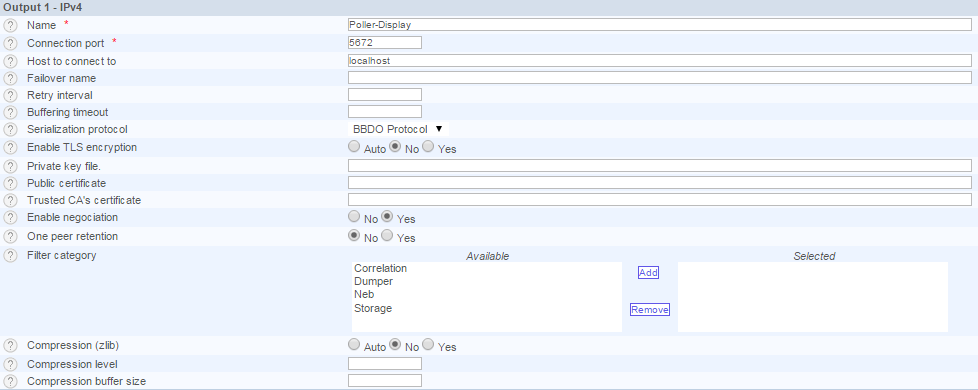

"Poller-Display-Broker" Configuration
-------------------------------------

The second step is to configure the stream between Centreon-Broker module on the Poller server and Centreon-Broker daemon (cbd) on the Poller server. A Centreon-Broker daemon (cbd) is required on the poller to generate datas in centreon_storage database for the Centreon light GUI to work.
For that, go to:

::

 Configuration > Centreon > Centreon-Broker > Configuration > Add

And follow the following steps.

**Step 1 : General tab**

.. image:: images/General-1.png
   :align: center
   :width: 800 px

Configure your Broker file.

.. note::
  You must name the configuration of the SQL Broker daemon file on the Poller with the same name of the Central for the init file to work out without any major changes. The name must be Central-Broker.xml even if server is a Poller.

**Step 2 : Input tab**

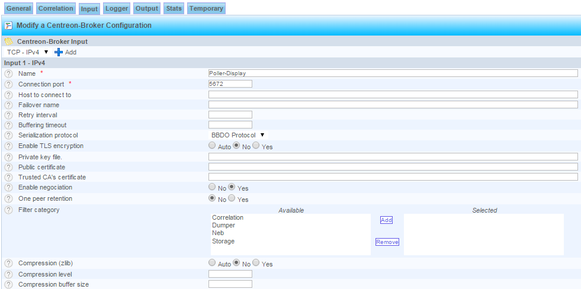

Add an *IPV4* output type

**Step 3 : Logger tab**

.. image:: images/Logger-1.png
   :align: center
   :width: 800 px

Add a *Logger* of  *File* type

**Step 4 : Output tab**

Now we add several *output*.

**Step 4a : 'Real time' database connection**

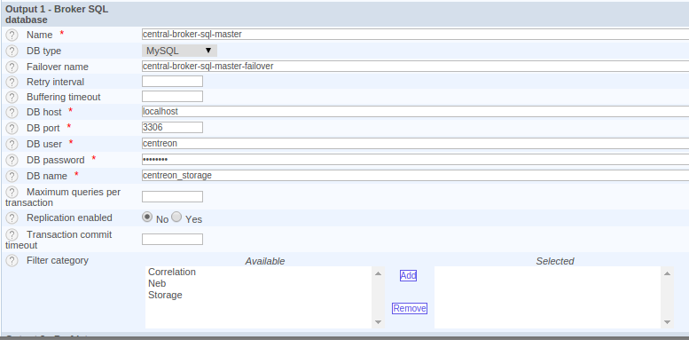

Add a *Broker SQL database* output type

.. note::
  Warning, Centreon database access is made on the poller. Use the centreon MySQL user credentials of the poller.

**Step 4b : data_bin data storage**

Add a *Perfdata Generator (Centreon Storage)* output type

.. image:: images/Output-1-2.png
   :align: center
   :width: 800 px

.. note::
   The option **Store in performance data in data_bin** and **Insert in index data** must be set to **Yes** otherwise graphs won't be generated.

Add an *IPV4* output type

.. note::
  Warning, Centreon database access is made on the poller. Use the centreon MySQL user credentials of the poller.

**Step 4c : Network stream to the local RRD Broker**

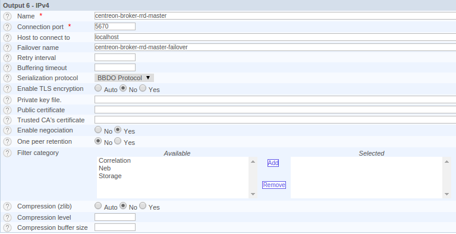

Add an *IPV4* output type

**Step 4d : Network stream to the local MySQL Broker**

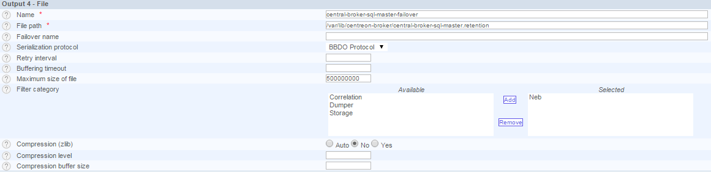

Add an *IPV4* output type

**Step 4e : RRD Failover**

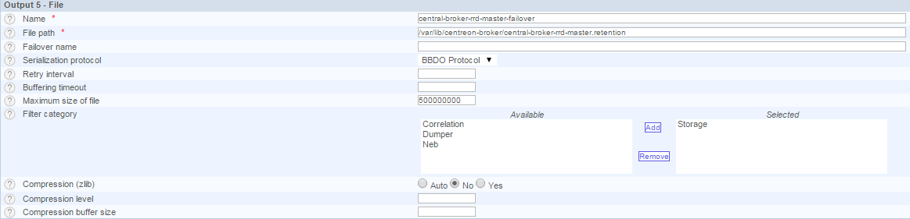

Add a *File* output type

**Step 4f : SQL Failover**

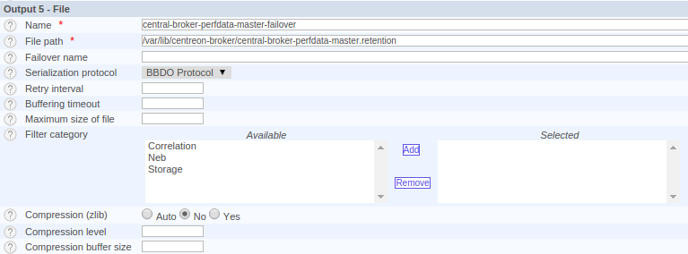

Add a *File* output type

You can now validate form. Configuration is now Ok for this object.

|

"Poller-Display-RRD" configuration
----------------------------------

This step aims to configure the dedicated stream for RRD's file generation on the Poller. For this go to : 

::

 Configuration > Centreon > Centreon-Broker > Configuration > Add

and follow this steps.

**Step 1 : General tab**

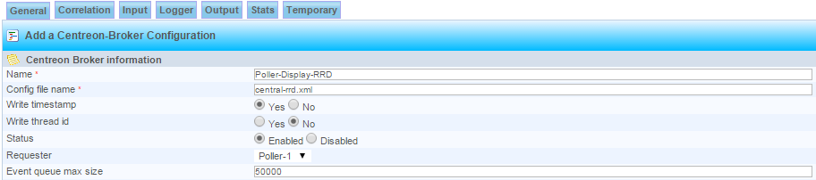

Configure your Broker file

.. note::
  You must name the configuration of the RRD Broker daemon file on the Poller with the same name of the Central for the init file to work out without any major changes. The name must be Central-rrd.xml even if server is a Poller.

**Step 2 : Input tab**

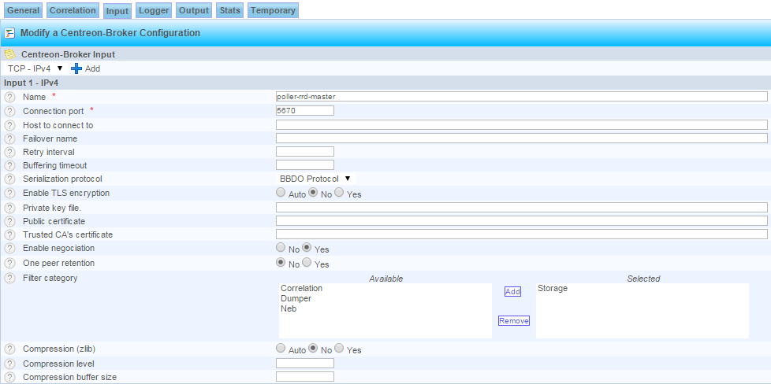

Add an *IPV4* output type

**Step 3 : Logger tab**

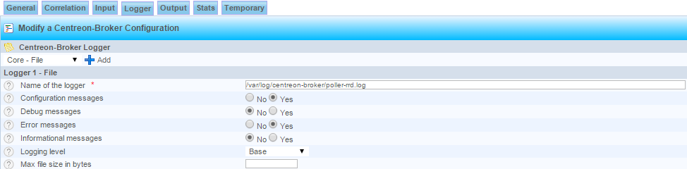

Add a *Logger* of  *File* type

**Step 4 : Output tab**

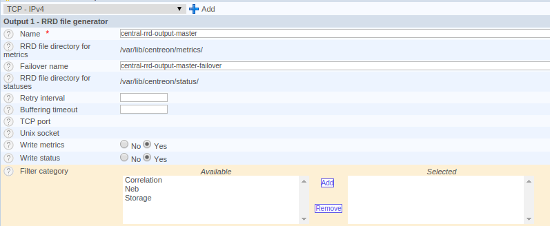

Add an *IPV4* output type

**Step 5 : Add a Failover**

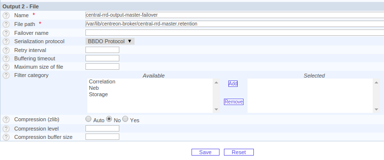

Add a *File* output type

You can now validate form. Configuration is done for this object.

|

.. warning::
   On the Centreon light GUI on the poller's side in the menu : **Administration** > **Options** > **Centstorage** > **Options**, the option **Enable resources's insertion in index_data by Centreon** must not be checked.

You can now proceed to the next step to apply changes.
