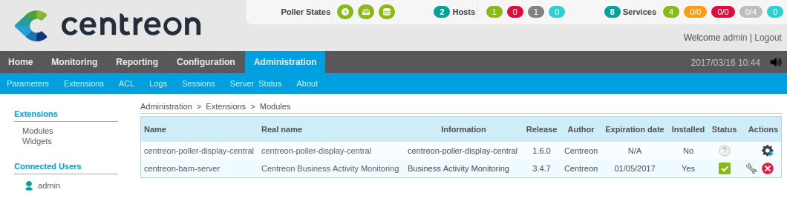

Installation
============

Installation on the central server
^^^^^^^^^^^^^^^^^^^^^^^^^^^^^^^^^^

From the repository
-------------------

Refer to `Centreon Web's documentation <https://documentation.centreon.com/docs/centreon/en/2.8.x/installation/index.html>`_
to properly install and configure your central server.

Once done, you will need to install the *centreon-poller-display-central* module.

::

 yum install centreon-poller-display-central

Web Installation
----------------

Next installation steps are made from **Centreon** Web interface.

Go to the modules management menu : Administration > Extensions

Click on the installation icon of the **centreon-poller-display-central** module.

On the next page, click on "Install Module".

Module is now installed.

Installation on the poller
^^^^^^^^^^^^^^^^^^^^^^^^^^

From the repository
-------------------

Centreon-poller-display is only compatible with pollers made with CES distribution.

To install, proceed with the Central Server with Database installation option of the CES installation (including Database,
Apache, Broker... components) and configure it like a Poller. Next you will be able to install the module :

::

 yum install centreon-base-config-centreon-engine centreon-poller-display

.. note::
   It is possible to install the package on an already existing Poller.

.. warning::
   In case of installation on an existing poller it is necessary to reconfigure centreontrapd (installation process overrides the configuration).

Web Installation
----------------

.. note::
    Before enable this module, you have to create your users account and set ACL definition. Indeed, if the module
    is enabled, the menus to configure this objects will no more available. However, you can disable the module
    to configure this objects and enable after.

Next installation steps are made from **Centreon** Web interface.

Go to the modules management menu : Administration > Extensions

.. image:: images/centreon_administration_modules.png
   :align: center
   :width: 800 px

Click on the installation icon of the **centreon-poller-display** module.

On the next page, click on "Install Module".

Module is now installed.

The Centreon interface menus should not be visible anymore.
