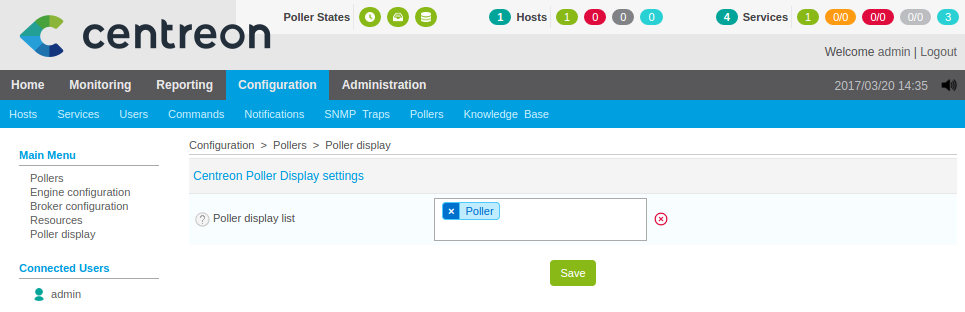

Configuration
=============

.. note::

   Toute la configuration s'effectue sur le serveur central.

Déclarer la présence de poller-display
^^^^^^^^^^^^^^^^^^^^^^^^^^^^^^^^^^^^^^

Sur le serveur central, vous devez tout d'abord déclarer la présence du module
poller-display sur le poller. Ceci se fait grâce au module de configuration
**centreon-poller-display-central**. Rendez-vous à

::

   Configuration > Collecteurs > Poller display

Ajoutez votre poller à la liste des poller disposant de poller-display et
sauvegardez.

Configuration de Centreon Broker
^^^^^^^^^^^^^^^^^^^^^^^^^^^^^^^^

Il est maintenant nécessaire de configurer différents nouveaux flux Centreon-Broker au niveau du serveur de type "poller" qui hébergera l'interface web. Ces flux sont à configurer au niveau du serveur central. Il ne sera jamais nécessaire de configurer quoi que ce soit au niveau du poller au sujet de la configuration des ressources supervisées. Seule les ACL, les contacts et les options générales peuvent être configurées au niveau des pollers.

Pour gérer les différents flux de Centreon-Broker, il est nécessaire de créer trois configurations différentes :

* Une configuration "classique" entre le module Centreon-Broker du collecteur et le démon Centreon-Broker sur le serveur central
* Une configuration pour le flux entre le module Centreon-Broker sur le collecteur et le démon Centreon-Broker sur le poller
* Une configuration pour le flux vers le démon Centreon-Broker pour la génération des fichiers RRDs.

Configuration "Poller"
----------------------

La première étape revient à configurer votre poller avec une configuration classique. Il est donc possible de la générer avec le wizard. Dans le menu :

::

 Configuration > Collecteurs > Configuration de Centreon Broker > Ajouter avec l'assistant

* Sélectionnez l'option *Collecteur uniquement*.
* Cliquez sur Suivant.
* Donnez un nom à votre fichier de configuration (nous utiliserons "poller" dans notre exemple).
* Sélectionnez le poller voulu.
* Selectionnez le protocole  de communication (NDO ou BBDO). Cela doit être le même que pour votre serveur central.
* Indiquez l'addresse du serveur Central.

Il est possible que vous n'ayez pas besoin de passer par cette étape si votre poller est déjà en fonctionnement et que les données remontent déjà sur le serveur central.

Il est toutefois nécessaire de configurer la connexion entre ce module Broker et le démon broker local.
Pour cela, dans la configuration de ce poller, il est nécessaire d'ajouter un **Output** de type **IPv4** :

.. image:: images/poller-output.png
   :align: center

Configuration "Poller-Display-Broker"
-------------------------------------

La deuxième étape consiste à configurer le flux entre le module Centreon-Broker du poller et le démon Centreon-Broker sur le poller. Un démon Centreon-Broker sera nécessaire afin de constituer un cache local dans la base de données "centreon_storage" pour que l'interface Web de Centreon puisse l'afficher. Pour cela aller dans :

::

 Configuration > Collecteurs > Configuration de Centreon Broker > Ajouter

et suivez les différentes étapes.

**Etape 1 : Onglet General**

.. image:: images/General-1.png
   :align: center

Configurer votre fichier broker

.. note::
  Pensez à nommer le fichier de configuration du démon sql avec le même nom que sur le serveur central afin que le script d'init puisse le prendre en compte sans changement majeur. Le nom doit être central-broker.xml même si le serveur est un poller.

**Etape 2 : Onglet Input**

.. image:: images/Input-1.png
   :align: center

Ajoutez un Input de type *IPv4*.

**Etape 3 : Onglet Logger**

.. image:: images/Logger-1.png
   :align: center

Ajoutez un Logger de type *File*.

**Etape 4 : Onglet Output**

Nous allons maintenant ajouter plusieurs "output".

**Etape 4a : Connexion à la base de données 'temps réel'**

Ajoutez un Output de type *Broker SQL database*.

.. image:: images/Output-1-1.png
   :align: center

.. note::
  Attention, les accès à la base de données sont ceux de la base de données du poller. Connectez vous au poller pour connaître le mot de passe de la base de données pour l'utilisateur "centreon".

**Etape 4b : stockage des données dans data_bin**

Ajoutez un Output de type *Perfdata Generator (Centreon Storage)*.

.. image:: images/Output-1-2.png
   :align: center

**Etape 4c : envoi de flux vers le broker rrd local**

Ajoutez un Output de type *IPV4*.

.. image:: images/Output-1-3.png
   :align: center

Vous pouvez maintenant valider le formulaire. Votre configuration est maintenant opérationnel pour cet objet.

Configuration "Poller-Display-RRD"
----------------------------------

Cette étape consiste maintenant à configurer le flux pour la création des fichiers RRDs sur le poller. Un démon "RRD" sera également ajouté pour la création des bases de données RRDTool sur le poller comme nous avons l'habitude de le faire sur le serveur Central. Pour cela aller dans :

::

 Configuration > Collecteurs > Configuration de Centreon Broker > Ajouter

et suivez les différentes étapes.

**Etape 1 : Onglet General**

.. image:: images/General-2.png
   :align: center

Configurer votre fichier broker

.. note::
  Pensez à nommer le fichier de configuration du démon rrd avec le même nom que sur le serveur central afin que le script d'init puisse le prendre en compte sans changement majeur. Le nom doit être central-rrd.xml même si le serveur est un poller.

**Etape 2 : Onglet Input**

Ajoutez un Input de type *IPv4*

.. image:: images/Input-2.png
   :align: center

**Etape 3 : Onglet Logger**

Ajoutez un Logger de type *File*

.. image:: images/Logger-2.png
   :align: center

**Etape 4 : Onglet Output**

Ajoutez un Output de type *RRD file generator*.

.. image:: images/Output-2-1.png
   :align: center

Vous pouvez maintenant valider le formulaire. Votre configuration est maintenant opérationnel pour cet objet.

Vous pouvez maintenant passer à l'étape suivante qui consistera à appliquer les modifications.
