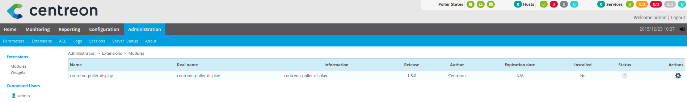

Installation
============

Depuis le repository
--------------------

Centreon-poller-display est compatible uniquement sur les pollers installés par la distribution CES (2.2 ou 3.0).

Pour l'installer, il est nécessaire d'installer un serveur centreon central et de le configurer comme étant un poller. Suite à cela, il est possible d'installer le module :

::

 yum install centreon-poller-display

.. note::
   Il est possible d'installer les paquets Centreon sur un poller déjà existant afin de lui ajouter l'interface local.

.. warning::
   En cas d'installation sur un poller dèjà existant, il sera alors nécessaire de reconfigurer centreontrapd (l'installation des paquets Centreon écrasent la configuration).

Installation Web
-----------------

La suite de l'installation de l'extension s'effectue via l'interface Web de **Centreon**.

Accéder au menu de gestion des modules : Administration > Extensions sur l'interface de votre poller

   
Au niveau du module "centreon-map-server" , cliquer sur l'icône d'installation.

Sur la nouvelle page cliquer sur "Installer Module" .

Le module est maintenant installé.

Vous pouvez vérifier la bonne installation du module en remarquant que tous les menus de l'interface ne sont maintenant plus accessibles.
