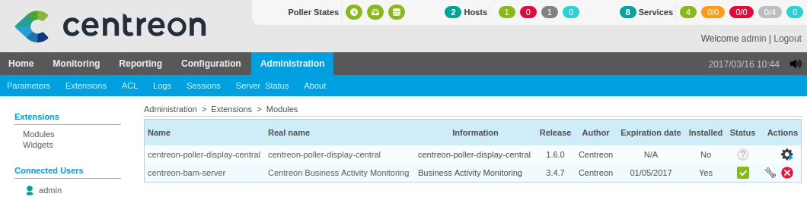

Installation
============

Installation sur le serveur central
^^^^^^^^^^^^^^^^^^^^^^^^^^^^^^^^^^^

Depuis le repository
--------------------

Référez-vous à la `documentation de Centreon Web <https://documentation-fr.centreon.com/docs/centreon/en/2.8.x/installation/index.html>`_
pour installer et configurer correctement votre serveur central.

Une fois ceci fait, installez le module *centreon-poller-display-central*.

::

  yum install centreon-poller-display-central

Installation Web
----------------

La suite de l'installation de l'extension s'effectue via l'interface web de **Centreon**.

Accédez au menu de gestion des modules : Administration > Extensions.

Cliquez sur l'icone d'installation du module **centreon-poller-display-central**.

Sur la page suivante, cliquer sur "Installer le module".

Le module est maintenant installé.

Installation sur le poller
^^^^^^^^^^^^^^^^^^^^^^^^^^

Depuis le repository
--------------------

Centreon-poller-display est compatible uniquement sur les pollers installés par la distribution CES.

Pour l'installer, il est nécessaire d'installer un serveur centreon central (comprenant tous les composants : BDD, Apache, Broker, ...) et de le configurer comme étant un poller. Suite à cela, il est possible d'installer le module :

::

 yum install centreon-base-config-centreon-engine centreon-poller-display

.. note::
   Il est possible d'installer le paquet **centreon** sur un poller déjà existant afin de lui ajouter l'interface local.

.. warning::
   En cas d'installation sur un poller dèjà existant, il sera alors nécessaire de reconfigurer centreontrapd (l'installation des paquets Centreon écrasent la configuration).

Installation Web
-----------------

.. note::
    Avant d'activer le module, il est nécessaire de créer les comptes utilisateurs ainsi que les ACL.
    En effet, une fois le module activé, ces menus ne seront plus disponibles. Toutefois, vous pouvez désactiver
    le module pour modifier la configuration des utilisateurs et des ACL puis réactiver ce dernier.

La suite de l'installation de l'extension s'effectue via l'interface Web de **Centreon**.

Accéder au menu de gestion des modules : Administration > Extensions sur l'interface de votre poller

.. image:: images/centreon_administration_modules.png
   :align: center
   :width: 800 px

Au niveau du module **centreon-poller-display** , cliquer sur l'icône d'installation.

Sur la nouvelle page cliquer sur "Installer Module" .

Le module est maintenant installé.

Vous pouvez vérifier la bonne installation du module en remarquant que tous les menus de l'interface ne sont maintenant plus accessibles.
